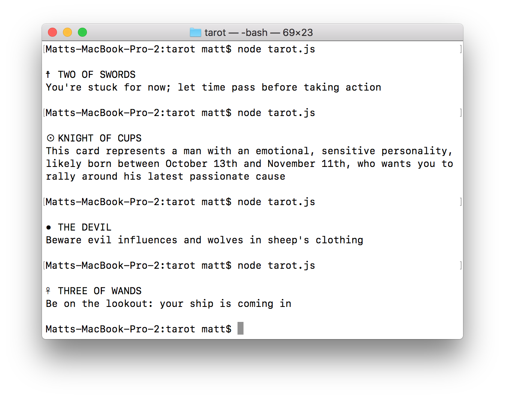

# Week 2 — Day 1 (Offline)

First we will review some of what we learned last week.

Then we will learn:

- Terminal / Command-Line
- Node.js and npm
- JSON and CSV formats
- Reading & Writing Files in Node.js
- Working with public JSON data
- Taking your p5.js Projects Offline with `http-server`

## Slides

[Link to slides PDF](https://drive.google.com/file/d/1AcDsgPnbdmo-lP9TkY_gZwx0_9hHgISc/view?usp=sharing)

## Guides

- JavaScript
  - [The Coding Train](https://thecodingtrain.com)
  - [JavaScript for Cats](http://jsforcats.com/)
  - [Programming from A to Z](https://shiffman.net/a2z/)
- Terminal
  - [Course Guide](../../guides/terminal.md)
- Node.js and npm
  - [Course Guide](../../guides/node-and-npm.md)
  - [Code Snippets](../../guides/node-snippets.md)
- JSON
  - [Simple JSON Guide](http://montoyamoraga.io/tutorial-json/)
  - [MDN JSON Guide](https://developer.mozilla.org/en-US/docs/Learn/JavaScript/Objects/JSON)
- CSV
  - [Course Guide](../../guides/csv.md)

## Data

Right click and "Save Link As" to download the JSON and CSV files.

- [Tarot Card Interpretations](https://github.com/dariusk/corpora/raw/master/data/divination/tarot_interpretations.json) – JSON
- [London Daily Rainfall (2007 – 2019)](https://raw.githubusercontent.com/mattdesl/bartlett-dfpi/master/notes/Week2/src/weather-london/daily-rainfall.json) – JSON (see [here](https://data.london.gov.uk/dataset/daily-areal-rainfall) for more info about the data)
- [NYC Daily Weather (2016)](https://raw.githubusercontent.com/mattdesl/bartlett-dfpi/master/notes/Week2/src/weather-nyc/weather_data_nyc_centralpark_2016.csv) – CSV (see [here](https://www.kaggle.com/mathijs/weather-data-in-new-york-city-2016) for more info about the data)

## References

- Data Artworks & Information Designers
  - [Simulated Dendrochronology of U.S. Immigration](https://web.northeastern.edu/naturalizing-immigration-dataviz/) by National Geographic, Northeastern University
  - [Block Bills](http://www.digital-projects-index.julien-drochon.net/portfolio/block-bills/) by Matthias Dorfelt
  - [Every NYT Front Page Since 1852](https://vimeo.com/204951759)
  - [Tōhoku Japanese Earthquake Sculpture](https://www.lukejerram.com/tohoku-japanese-earthquake/) by Luke Jerram
  - [The Sleep Blanket](https://www.theverge.com/2019/7/21/20699484/sleep-blanket-data-visualisation-seung-lee) by Seung Lee
  - [Coral Cities](https://www.archdaily.com/908260/coral-cities-the-worlds-most-liveable-cities-visualized) by Craig Taylor
  - [Melting Memories](http://refikanadol.com/works/melting-memories/) and [Wind of Boston](https://visuall.net/2017/03/22/wind-of-boston-series-of-data-paintings-by-refik-anadol-studio/) by Refik Anadol
  - [Giorgia Lupi](https://giorgialupi.com/data-portraits-at-ted2017)
  - [Stefanie Posavec](http://www.stefanieposavec.com/)
  - [Valentina D'Efilippo](http://www.valentinadefilippo.co.uk/)
  - [Nadieh Bremer](https://www.visualcinnamon.com/)
- Simple JSON Datasets
  - [awesome-json-datasets](https://github.com/jdorfman/awesome-json-datasets)
  - [corpora](https://github.com/dariusk/corpora)
  - [color-names](https://github.com/meodai/color-names)
  - [all-the-cities](https://www.npmjs.com/package/all-the-cities)
  - [supervillains](https://www.npmjs.com/package/supervillains) and [superheroes](https://www.npmjs.com/package/superheroes)
  - [nice-color-palettes](https://www.npmjs.com/package/nice-color-palettes)
- More Dataset Ideas
  - [Google Trends](https://trends.google.com/trends/)
  - [Kaggle Datasets](https://www.kaggle.com/datasets)
  - [Library of Congress](https://www.loc.gov/pictures/)
  - [NYPL Digital Collections](https://digitalcollections.nypl.org)
  - [Andy Kirk's List of Data Sources](https://www.visualisingdata.com/2017/02/archiving-collection-places-access-data/)
- Tools
  - [http-server](https://www.npmjs.com/package/http-server)

## Exercises

### Tarot Card Bot *(Simple)*

  - Write a Node.js Program that Picks a random Tarot Card from a deck and prints your fortune
  - Data: [tarot_interpretations.json](https://github.com/dariusk/corpora/raw/master/data/divination/tarot_interpretations.json) (Right Click > Save As)
  - Solution: [./src/tarot/tarot.js](./src/tarot/tarot.js)

### p5.js Data Painting *(Advanced)*

###

  - Using daily rainfall data, create random circles for each day of data, with diameter mapped to rainfall measurements (see [Data](#data) above for JSON and CSV data files)
  - **Hint:** See [this code snippet](../../guides/csv.md#fetch-json) for details on how to bring JSON files into your p5 project
  - [Example](https://p5-data-painting.glitch.me/)
  - [Code on Glitch.com](https://glitch.com/edit/#!/p5-data-painting)

## Final Assignment

I'm assigning the final assignment now, I want you to discuss it tonight and tomorrow and place yourself into groups (of 1 or 2 people) by tomorrow end of day.

- **Brief:** Create something that is engaging & delightful that can be presented in the Tate Late show.

- **Theme:** The curatorial theme is *Bauhaus*.

- **Outputs:** Choose one:

  - **Website:** for example a P5 app made with Glitch.com

  - **Video:** for example a looping animation or series of images

  - **Installation:** for example a site-specific piece that has to be experienced in person

- **Inputs:** Choose one:

  - **Generative:** for example random or algorithmic

  - **Mouse/Touch:** for example primarily working with mouse and touch interactions

  - **Data:** for example using data from an online or offline source

  - **Sensors:** for example using a [Raspberry Pi and Enviro pHAT](https://shop.pimoroni.com/products/enviro-phat) to drive the installation

Projects are either solo, or in a group of max 2 people. For projects using **Data** or **Sensors** it may make sense to work in a team to split effort between frontend (visuals) and backend (networking/hardware).
